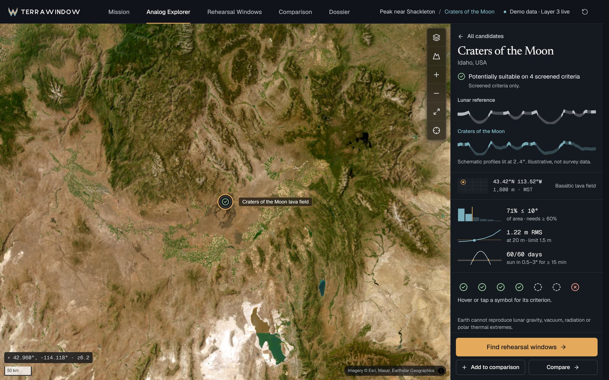
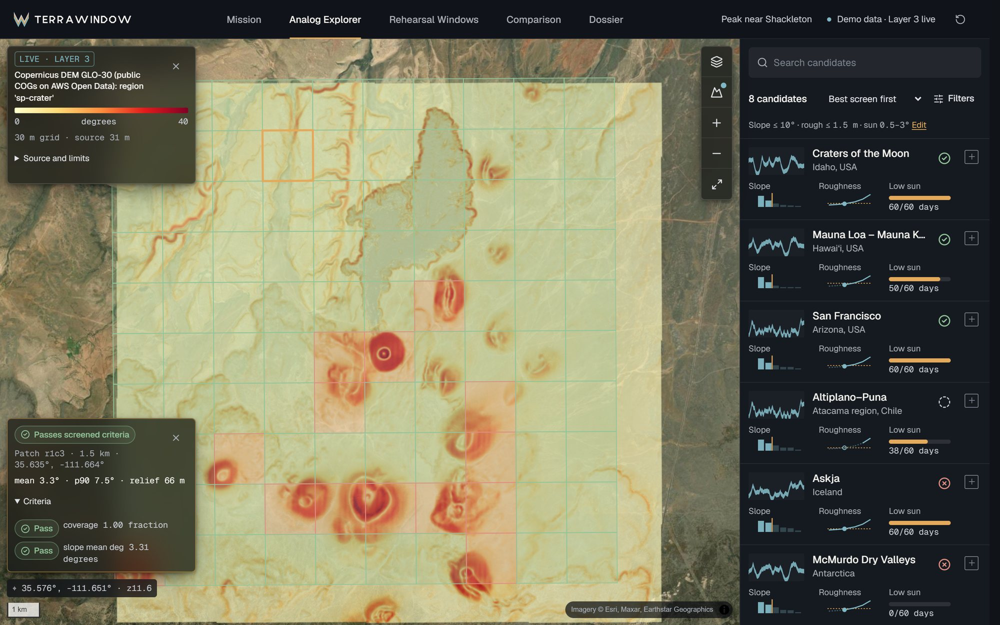
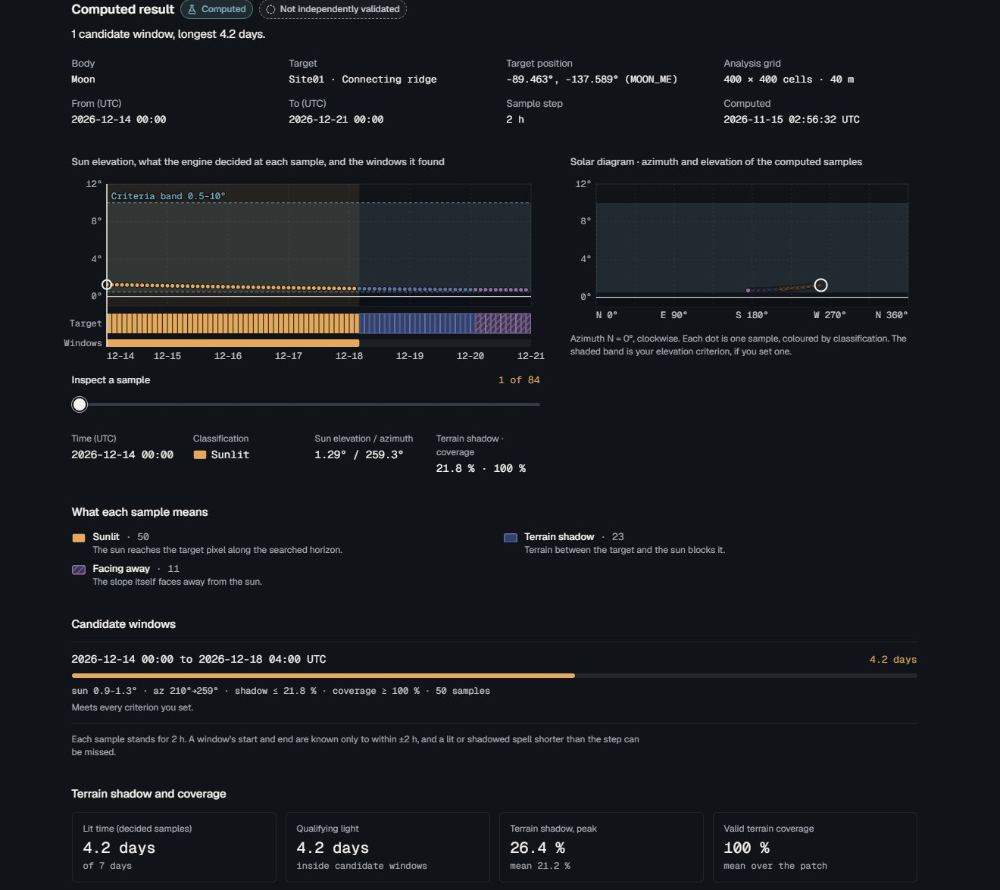
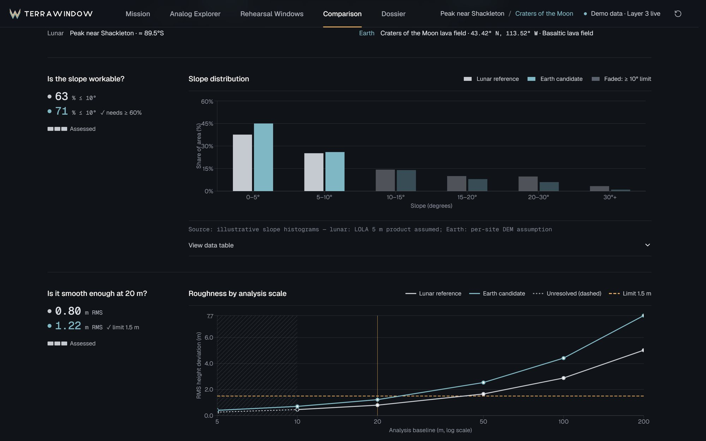
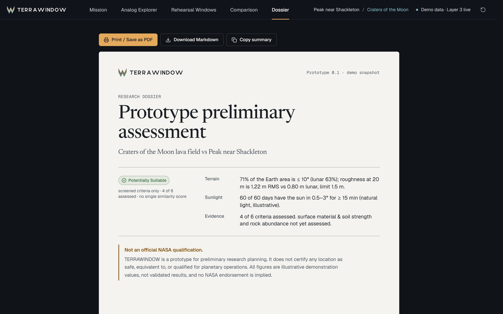
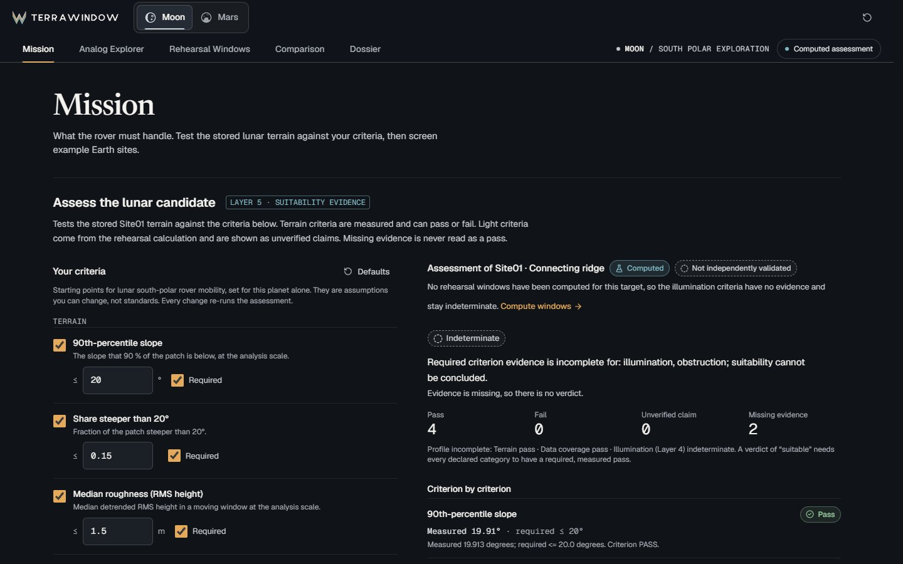
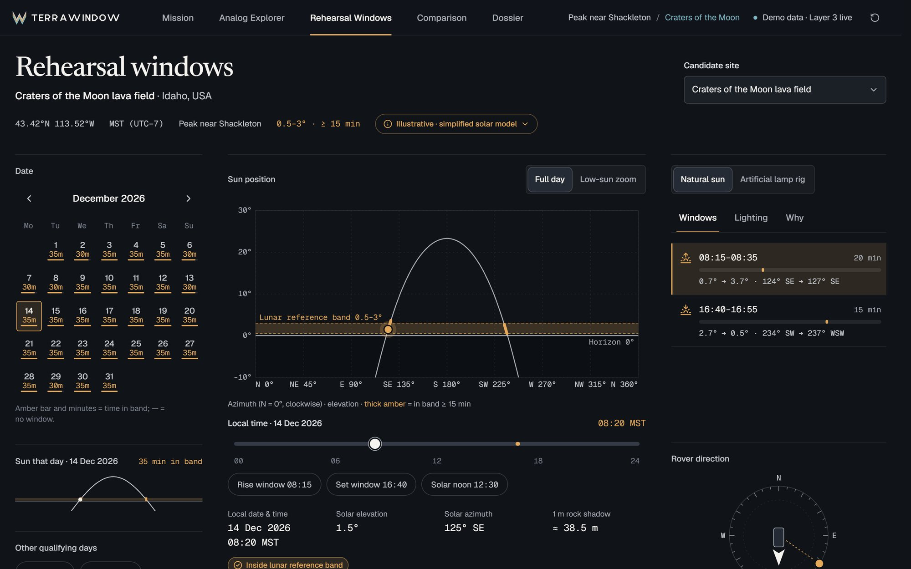
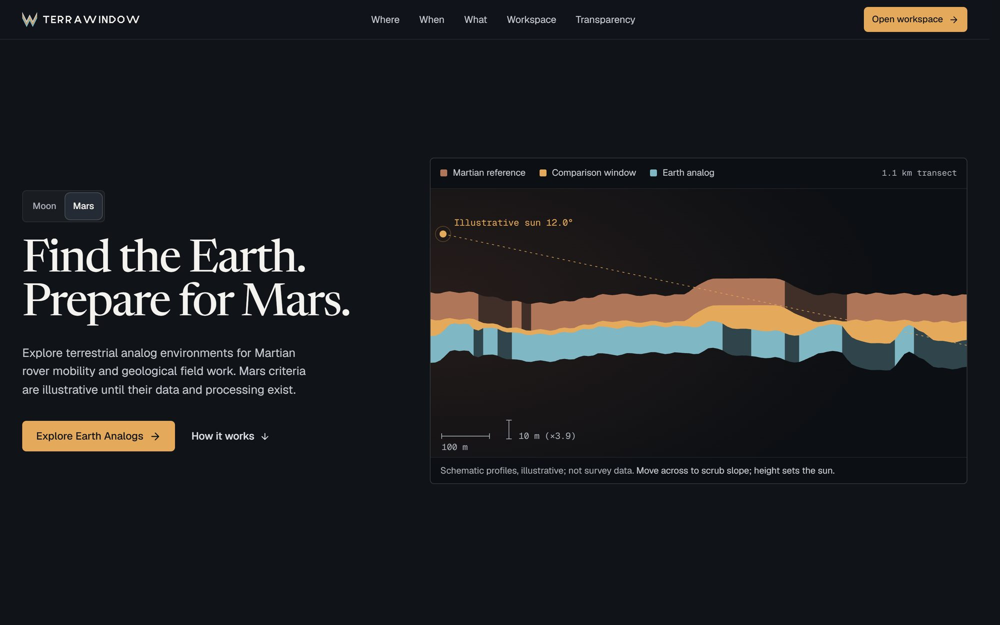
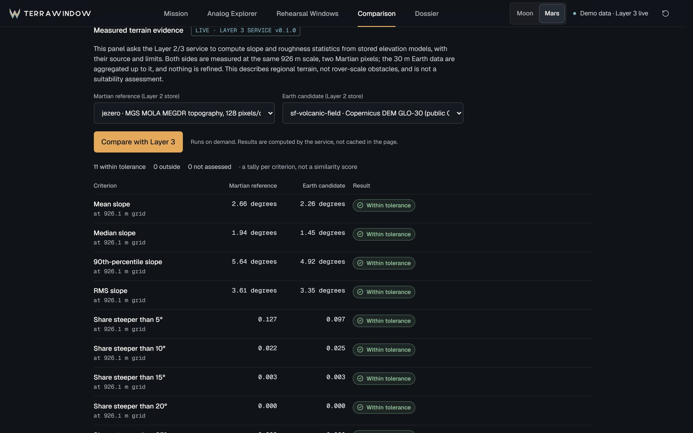
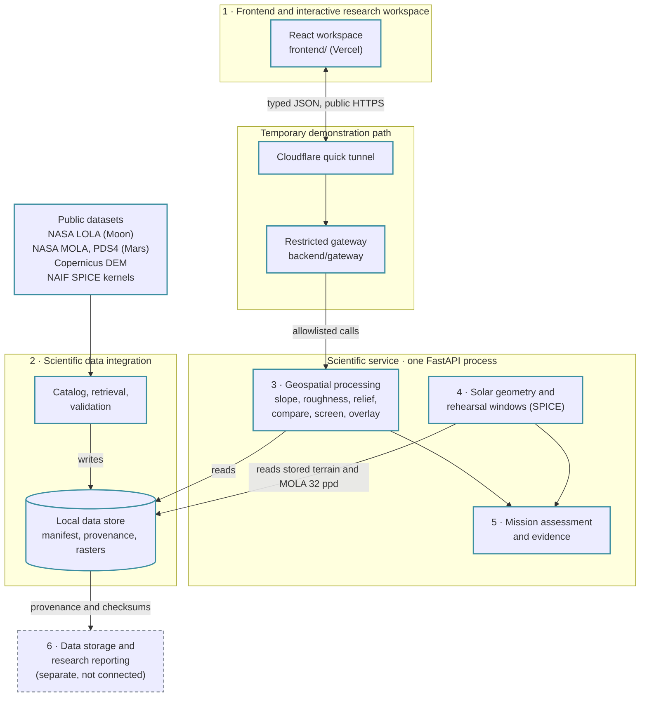

<p align="center">
  <picture>
    <source media="(prefers-color-scheme: dark)" srcset="frontend/public/brand/terrawindow-lockup-dark.svg">
    
  </picture>
</p>

<h3 align="center">Find the Earth. Test for the Moon.</h3>

<p align="center">
  Mission-specific Earth analog discovery for the Moon and Mars<br>
  <sub>NASA Space Apps Challenge 2026 · Research prototype</sub>
</p>

<p align="center">
  
</p>

> TERRAWINDOW is an independent entry to the NASA Space Apps Challenge. It is not affiliated with or endorsed by NASA, it does not certify any site, and it produces no single Moon–Earth similarity score.

## Overview

A rover that will drive on the lunar south pole needs somewhere on Earth to rehearse. Finding that place is harder than looking for terrain that resembles the Moon: slope and roughness only compare where the elevation data can resolve them, the sun sits a few degrees above the horizon there, and gravity, vacuum, radiation and cold cannot be reproduced on Earth at all.

That need is documented: a U.S. Geological Survey community survey ([Edgar et al., 2024](https://doi.org/10.3133/ofr20241042)) assesses what researchers need from terrestrial analog studies, and NASA human-factors work shows that south-polar lighting makes driving and vision a distinct problem ([Litaker et al., 2024](https://ntrs.nasa.gov/citations/20240011393); [Null, 2025](https://ntrs.nasa.gov/citations/20250003890); [NESC, 2024](https://www.nasa.gov/centers-and-facilities/nesc/characterizing-the-visual-experience-of-astronauts-at-the-lunar-south-pole/)). TERRAWINDOW is an entry to the [NASA Space Apps Challenge 2026](https://www.spaceappschallenge.org/2026/challenges/permanent-moon-base-locations-and-mars/) challenge on terrestrial analogs for Moon and Mars locations. These sources motivate the work; none validates a TERRAWINDOW result.

TERRAWINDOW helps a researcher work through that question in the open. It discovers candidate Earth terrain against a stated lunar reference and mission limits, compares the two surfaces criterion by criterion at scales the data can support, and explores when low-angle lighting on Earth resembles the lunar case. Every verdict stays tied to its evidence: what was measured, at what resolution, from which dataset, and what is still missing.

TERRAWINDOW covers two planetary targets in one workspace, switched with the **Moon / Mars** control in the landing page and the workspace header.

- **Moon** is the full prototype scope: lunar south-polar rover mobility and navigation under low-angle illumination, with illustrative mission screens and measured terrain evidence from NASA LOLA data.
- **Mars** is a regional, data-backed experience: **terrain measured from NASA MOLA topography** (the Jezero region, 463 m pixels) compared with measured Earth terrain per criterion at one stated scale, **solar geometry computed with SPICE** for Mars, and a mission assessment that keeps Layer 4 values as unverified claims. It has no rover-scale terrain and no Mars-specific mission standards. See [Mars research support](#mars-research-support) and [Layers 4 and 5](#layers-4-and-5-solar-geometry-and-mission-assessment).

## Product showcase

<table>
  <tr>
    <td width="50%"><br><sub><b>Mission Workspace.</b> Set the lunar reference and rover limits; example sites re-screen as you change them. <i>Example-site screening is illustrative; the Layer 5 assessment above it (next table) is computed.</i></sub></td>
    <td width="50%"><br><sub><b>Analog Explorer.</b> A satellite map with a visual candidate browser and a per-site inspector. <i>Example sites are illustrative.</i></sub></td>
  </tr>
  <tr>
    <td width="50%"><br><sub><b>Live terrain.</b> Slope overlay and candidate-patch screening computed by the geoprocessing service from a stored Copernicus DEM. <i>Measured, labelled live.</i></sub></td>
    <td width="50%"><br><sub><b>Rehearsal Windows (computed).</b> Layer 4 on stored Site01: sun elevation, per-sample illumination class, candidate window, terrain shadow, provenance and limitations. <i>Computed, not independently validated.</i></sub></td>
  </tr>
  <tr>
    <td width="50%"><br><sub><b>Scientific Comparison.</b> Slope and roughness against the rover limit, with resolution shown. <i>Illustrative; a separate panel shows measured evidence.</i></sub></td>
    <td width="50%"><br><sub><b>Research Dossier.</b> A printable preliminary assessment with provenance and an explicit disclaimer. <i>Demonstration content; a separate section shows computed results when run, marked as not stored.</i></sub></td>
  </tr>
  <tr>
    <td width="50%"><br><sub><b>Mission assessment (Layer 5).</b> Criteria you set, measured Layer 3 evidence that passes or fails, and Layer 4 evidence shown only as an unverified claim. Missing evidence gives <i>Indeterminate</i>, never a pass. <i>Computed; thresholds are assumptions.</i></sub></td>
    <td width="50%"><br><sub><b>Illustrative preview.</b> What Rehearsal Windows shows before a calculation is run (simplified flat-horizon model, no terrain shadows). It is hidden after a run and whenever the service is down. <i>Illustrative.</i></sub></td>
  </tr>
</table>

### Mars

<table>
  <tr>
    <td width="33%"><br><sub><b>Planet switch.</b> The hero deforms the same ribbons from lunar to Martian relief. The profile is a schematic landform, not survey data.</sub></td>
    <td width="33%"><br><sub><b>Measured Martian terrain.</b> Jezero region from MOLA, rendered and measured by Layer 3, with scale, coverage and provenance. <i>Measured, labelled live.</i></sub></td>
    <td width="33%"><br><sub><b>Mars against Earth.</b> Slope, roughness and relief per criterion at a shared 926 m scale. A tally of criteria, not a score. <i>Measured, labelled live.</i></sub></td>
  </tr>
</table>

## Core capabilities

| Capability | What it does | Status |
|---|---|---|
| **Guide and glossary** | A skippable, optional six-step guide for first-time visitors (Moon or Mars, mission, Earth candidates, comparison, rehearsal windows, dossier), reopened from the Guide button; plain-language definitions of terms such as provenance, roughness and indeterminate | Interface only; stored in the browser, no backend |
| **Mission Workspace** | Defines the lunar reference and rover limits; assesses stored Site01 with Layer 5; re-screens example sites | Assessment: **computed** (Layers 3 and 5). Example-site screening: illustrative |
| **Earth Analog Explorer** | Satellite map, candidate browser, site inspector, comparison basket | Example sites: demonstration. **Live terrain: operational** (Layers 2–3) |
| **Terrain analysis** | Slope, roughness, relief and profiles at stated grid scales; overlays; candidate-patch screening | **Operational** (Layer 3) |
| **Scientific comparison** | Lunar reference against an Earth candidate, criterion by criterion, with no combined score | Demonstration sections. **Measured evidence panel: operational** (Layers 2–3) |
| **Rehearsal-window exploration** | Solar elevation and azimuth, terrain illumination and shadow classification, and candidate windows for a stored Moon, Earth or Mars target | **Computed** by Layer 4 when the service is reachable (not observationally validated). The calendar-style view stays a labelled illustration until a calculation is run |
| **Mission assessment** | Criterion-by-criterion assessment of a stored candidate against mission criteria you set, with the evidence it rests on and the evidence it lacks | **Computed** by Layer 5 when the service is reachable. Layer 4 values appear as unverified claims; missing evidence is never a pass |
| **Research dossier** | Printable preliminary assessment, Markdown export; a section lists the computed Layer 4 and 5 results of the session | Demonstration content plus computed results **not stored** (Layer 6 is not connected) |
| **Mars reference terrain** | MOLA elevation, slope, roughness and relief of the Jezero region at 463 m to 1.8 km, with coverage and provenance | **Operational** (Layers 2–3); needs the service and the retrieved region |
| **Mars–Earth comparison** | Measured Martian terrain against a measured Earth candidate at 926 m, per criterion, with no combined score | **Operational** (Layers 2–3). Layer 5 evidence is shown beside it; there is no combined suitability verdict |
| **Mars dossier and rehearsal windows** | Regional solar geometry at 1.85 km MOLA (Layer 4) and a terrain-evidence dossier | Windows: **computed** when the service is reachable, with unobserved MOLA bins shown as insufficient coverage. Dossier: computed results not stored; no Layer 6 report is produced |

An implemented interface is not the same as an operational scientific feature. Live content is labelled **LIVE · LAYER 3** and carries its dataset, citation, grid size and limitations. If the service is offline, a dataset is unavailable or a request fails, the interface says so and shows nothing in its place: demonstration values are never substituted for a missing result.

## Architecture


```mermaid
flowchart TB
    subgraph L1["1 · Frontend and interactive research workspace"]
        UI["React workspace<br/>frontend/ (Vercel)"]
    end
    subgraph DEMO["Temporary demonstration path"]
        TUN["Cloudflare quick tunnel"]
        GW["Restricted gateway<br/>backend/gateway"]
    end
    subgraph SVC["Scientific service · one FastAPI process"]
        API3["3 · Geospatial processing<br/>slope, roughness, relief,<br/>compare, screen, overlay"]
        API4["4 · Solar geometry and<br/>rehearsal windows (SPICE)"]
        API5["5 · Mission assessment<br/>and evidence"]
    end
    subgraph L2["2 · Scientific data integration"]
        STORE[("Local data store<br/>manifest, provenance, rasters")]
        FETCH["Catalog, retrieval,<br/>validation"]
    end
    SRC["Public datasets<br/>NASA LOLA (Moon)<br/>NASA MOLA, PDS4 (Mars)<br/>Copernicus DEM<br/>NAIF SPICE kernels"]
    L6["6 · Data storage and<br/>research reporting<br/>(separate, not connected)"]

    UI <-->|"typed JSON, public HTTPS"| TUN --> GW -->|"allowlisted calls"| API3
    API3 --> API5
    API4 --> API5
    API3 -->|reads| STORE
    API4 -->|"reads stored terrain and MOLA 32 ppd"| STORE
    FETCH -->|writes| STORE
    SRC --> FETCH
    STORE -->|provenance and checksums| L6

    classDef done stroke:#3b8ea0,stroke-width:2px
    classDef sep stroke:#7b838e,stroke-width:1.5px,stroke-dasharray:5 4
    class UI,API3,API4,API5,STORE,FETCH,SRC,TUN,GW done
    class L6 sep
```

<sub>Solid outline: implemented and connected. Dashed outline: implemented separately and not connected to the interface. The tunnel and gateway are a temporary demonstration path, not production hosting.</sub>

Status is stated per layer on six separate questions. "Integrated" means connected to the layers it depends on; "public" means reachable from the Vercel site while the demonstration is running (see [the temporary demo](#temporary-public-demonstration-cloudflare-tunnel)).

| Layer | Responsibility | Implemented | Integrated | Tested | Public (demo) | Independently validated | Where |
|---|---|---|---|---|---|---|---|
| 1 | Frontend and research workspace | Yes | Yes (Layers 3 to 5 through the API client) | 65 unit tests; browser, keyboard, contrast and axe checks on both planets at seven widths | Yes, on Vercel | n/a (interface) | [`frontend/`](frontend) |
| 2 | Data integration: catalog, retrieval, validation, provenance | Yes (Moon, Earth, Mars) | Yes | 38 tests | Not directly | Mars region verified byte for byte against the PDS source; others checksummed | [`backend/data_integration`](backend/data_integration) |
| 3 | Geospatial processing and API | Yes | Yes | 100 tests, with synthetic planes of known slope | Yes, through the gateway | Slope checked against an independent calculation (3 %); no field validation | [`backend/geoprocessing`](backend/geoprocessing), [contract](docs/layer3-api-contract.md) |
| 4 | Solar geometry and rehearsal windows | Yes (SPICE; Earth, Moon, Mars) | Yes, as `/v1/rehearsal/*` | Service tests; real-terrain run; solar elevation vs independent references | Yes, through the gateway | Solar geometry cross-checked computationally; **illumination and shadows not observationally validated** | [`solar_geometry_engine`](solar_geometry_engine), [docs](solar_geometry_engine/LAYER4_DOCUMENTATION.md) |
| 5 | Mission suitability and evidence | Yes | Yes, as `/v1/suitability/*` | Behaviour tests (missing evidence, claims, body mismatch) | Yes, through the gateway | **No**; assessments are preliminary and thresholds are assumptions | [`suitability.py`](backend/geoprocessing/src/terrawindow_geo/suitability.py), [docs](docs/LAYER5_DOCUMENTATION.md) |
| 6 | Storage and research reporting | Yes (separate service) | **No**: not connected to the frontend or the live API; no Layer 4 or 5 record shapes | 13 of 13 against a local PostgreSQL 16 / PostGIS container; 11 pass and 2 skip without a database | **No** | n/a | [`backend/reporting`](backend/reporting) |

Layers 1 to 5 are implemented and connected. Layers 2, 3 and 4 have independent computational cross-checks; none of the six is observationally validated. Layer 6 is not part of the live demonstration.

The interface labels each result by what stands behind it: **computed** (a live service result), **illustrative** (a fixture or schematic), **insufficient evidence**, or **service unavailable**. None is labelled independently validated, because none is. Layer 6 records dataset provenance, analysis runs, and dossiers; it does not replace the file store or the processing cache, and nothing in the interface is stored by it.

## Technology stack

Versions are taken from `frontend/package.json` and `backend/*/pyproject.toml`.

| Area | Technologies |
|---|---|
| Frontend | React 19, TypeScript 6, Vite 8, Tailwind CSS 4, Motion, MapLibre GL JS 6, Recharts 3, lucide-react |
| Typography | Geist, Geist Mono and Newsreader via Fontsource |
| Backend | Python 3.12+, FastAPI, Uvicorn, Pydantic 2, rasterio, NumPy, SciPy, pyproj, Pillow, psycopg, fpdf2; SpiceyPy and Numba for Layer 4; httpx for the gateway |
| Data | GeoTIFF and cloud-optimised GeoTIFF; a file-based store with a version-controlled reference manifest; PostgreSQL and PostGIS for the Layer 6 registry |
| Quality | Vitest, ESLint, pytest, Playwright with axe-core (run outside the repository) |

## Getting started

**Prerequisites:** Node.js 22.12 or newer (20.19 is enough to run and build the frontend, but `npm test` needs 22.12), Python 3.12 or newer, and Git.

```bash
git clone https://github.com/sinagdevv/Supernobai-NASA.git
cd Supernobai-NASA
```

**1. Backend environment** (one virtual environment for Layers 2 and 3)

```bash
cd backend
python -m venv .venv
.venv/Scripts/python -m pip install -e "geoprocessing[dev,layer4]" -e "data_integration[dev]" -e "gateway[dev]" -e ../solar_geometry_engine
```

On macOS and Linux use `.venv/bin/python` and `.venv/bin/terrawindow-data` in place of `.venv/Scripts/...`.

**2. Retrieve datasets.** Rasters are never committed. The NASA download is about 41 MB and can take several minutes.

```bash
.venv/Scripts/terrawindow-data fetch lola-5mpp-site01
.venv/Scripts/terrawindow-data region copernicus-glo30 sp-crater -111.72 35.51 -111.54 35.655
.venv/Scripts/terrawindow-data region mola-megdr128 jezero 76.4 17.4 78.6 19.4
```

The Mars command reads a 2.2 x 2.0 degree window from the official PDS4 MOLA tile over HTTP range requests, so only the needed rows of the 130 MB tile are transferred (seconds, not minutes). To run the whole Mars–Earth measurement end to end, and the independent check of the retrieved Mars data against the raw PDS bytes:

```bash
cd geoprocessing
../.venv/Scripts/python scripts/mars_vs_earth.py
cd ..
.venv/Scripts/python data_integration/scripts/verify_mola_against_pds.py jezero-mola-megdr128
```

Check the result before using it. `check` lists each dataset as `available`, `missing`, `unreadable` or `not_validated`, with the command that fixes it, and exits 1 if any is unusable.

```bash
cd geoprocessing
../.venv/Scripts/python -m terrawindow_geo.cli check
```

**3. Layer 4 inputs** (needed for `/v1/rehearsal/evaluate`; Layers 2, 3 and 5 work without them)

The SPICE kernels (about 118 MB, NAIF) are in the repository under `solar_geometry_engine/kernels/kernels/`. Mars rehearsal windows read the native 32 pixel/degree MOLA grid, which is stored in the repository only as Git LFS pointers (three 133 MB images). **If Git LFS is installed, `git clone` downloads those 400 MB automatically** (set `GIT_LFS_SKIP_SMUDGE=1` to skip); point `TWGEO_MARS_MEGDR32_DIR` at `solar_geometry_engine/data/mars/mola_megdr/source` to use them. Otherwise fetch the files from NASA PDS into the folder the service reads by default; the engine checks them against the recorded SHA-256 values:

```bash
mkdir -p data/local/rehearsal/mars/mola_megdr/source
cp ../solar_geometry_engine/data/mars/mola_megdr/PROVENANCE.json data/local/rehearsal/mars/mola_megdr/
for f in megt90n000fb megr90n000fb megc90n000fb; do
  curl -L -o data/local/rehearsal/mars/mola_megdr/source/$f.img \
    https://pds-geosciences.wustl.edu/mgs/urn-nasa-pds-mgs_mola_topography_derived/meg032/$f.img
done
curl -s http://127.0.0.1:8000/v1/rehearsal/status   # once the service is running
```

`/v1/rehearsal/status` reports, per body, whether the package, kernels and Mars source are present. The Layer 4 engine reads and hashes the Mars images itself and refuses any that do not match.

**4. Run the service and the frontend**

```bash
# in backend/geoprocessing
../.venv/Scripts/python -m uvicorn terrawindow_geo.api.app:app --port 8000

# in a second terminal
cd frontend
npm ci
npm run dev
```

Without the service the interface shows its illustrative screens and an explicit *service unavailable* state wherever a result would be computed. The dev and preview servers proxy `/api` to `http://localhost:8000`; set `VITE_TERRAWINDOW_API` to point elsewhere.

**Tests and build**

| Command | Where | What it runs |
|---|---|---|
| `python -m pytest` | `backend/geoprocessing`, `backend/data_integration`, `backend/reporting`, `backend/gateway` | Backend suites (no network by default, `-m network` adds two; Layer 6 Postgres tests need `TERRAWINDOW_DATABASE_URL`; the Layer 4 run is skipped, and reported as skipped, without SPICE, Numba or kernels) |
| `python scripts/layer4_reference_check.py` | `backend/geoprocessing` | Layer 4 solar elevation against independent references (see [Layers 4 and 5](#layers-4-and-5-solar-geometry-and-mission-assessment)) |
| `npm test` | `frontend/` | Unit tests for the API boundary and the planet terrain |
| `npm run lint` | `frontend/` | ESLint |
| `npm run build` | `frontend/` | Type-check, then a production build in `dist/` |
| `npm run preview` | `frontend/` | Serve the production build |

### How dataset setup stays reproducible

`backend/data/manifest.json` and the `*.provenance.json` files beside the rasters are the **version-controlled reference**: what each dataset is, where it came from, and its checksum. `terrawindow-data` writes what happens on your machine (validation result, timestamps) to `backend/data/local/`, which is not committed, and the service reads the two together. Setting up data therefore leaves `git status` clean.

Each setup is compared with the reference provenance (SHA-256, size and source URLs) and reports `matches` or `differs`. A difference is flagged, never silently overwritten; use `--update-reference` to change the reference on purpose. Set `TERRAWINDOW_DATA_DIR` to keep the whole store outside the repository. The service decides whether a dataset is usable from the file itself, so a fresh checkout reports missing rasters as setup required and never as ready.

### Temporary public demonstration (Cloudflare tunnel)

The Vercel site has no scientific service behind it. For a live demonstration the service runs on one developer machine behind a restricted gateway, reached through a Cloudflare quick tunnel:

```text
Vercel frontend ──HTTPS──> Cloudflare quick tunnel ──> restricted gateway :8787 ──> Python scientific API :8000 (loopback only) ──> stored datasets and SPICE kernels
```

**The live scientific backend works only while that machine, the three processes and the tunnel are running. There is no 24/7 availability, and this is not production hosting.** A quick tunnel's address changes every time it starts, so the address is held as the `VITE_TERRAWINDOW_API` setting of the Vercel project (a public address, not a secret) and is not part of this repository; changing it needs a redeploy.

**Start (three terminals, in this order; full commands and recovery in the [gateway README](backend/gateway/README.md))**

```powershell
# 0. datasets present? (backend\geoprocessing)
..\.venv\Scripts\python -m terrawindow_geo.cli check
# 1. scientific API, loopback only, with the verified resource limits (backend\geoprocessing)
$env:TWGEO_MAX_PATCH_PIXELS=4000000; $env:NUMBA_NUM_THREADS=2
..\.venv\Scripts\python -m uvicorn terrawindow_geo.api.app:app --host 127.0.0.1 --port 8000 --workers 1 --limit-concurrency 8 --no-server-header
# 2. gateway (backend\gateway)
..\.venv\Scripts\python -m uvicorn terrawindow_gateway.app:app --host 127.0.0.1 --port 8787 --workers 1 --no-server-header
# 3. tunnel
cloudflared tunnel --url http://127.0.0.1:8787 --no-autoupdate
```

Then check `curl http://127.0.0.1:8787/health` and `/v1/rehearsal/status`. The **first Layer 4 request needs about 30 seconds** while Numba compiles; later requests take seconds.

**Resource limits (measured).** One API worker uses about 240 MB resident, the gateway about 60 MB and the tunnel about 40 MB. `TWGEO_MAX_PATCH_PIXELS=4000000` refuses near-native requests (a 5.5 m lunar grid peaked at 977 MB; the cap keeps the worst case near 470 MB) without affecting the interface's own requests; `NUMBA_NUM_THREADS=2` and `--limit-concurrency 8` bound the rest. Layer 4 itself limits samples (96), span (30 days) and patch cells (200,000).

**Gateway.** Ten allowlisted calls only; datasets by stored id (no paths or URLs); bounded areas, scales and body size; per-client rate limits; at most two heavy calculations and one Layer 4 run at a time; per-call timeouts; one safe error shape; local file paths hidden. It returns the service's results unchanged.

**Outage behaviour.** If the machine, API or tunnel is down, the public site shows its *service unavailable* state with a Try again button; it shows no measurement and no illustrative stand-in. Restarting the API restores service without any Vercel change; a restarted tunnel has a new address and needs the Vercel setting updated and a redeploy.

**Stop:** Ctrl+C in each terminal.

## Data sources

Only data that a reported result actually reads is listed as used; the full inventory, with identifiers, checksums, frames, licences and limitations, is in **[docs/SCIENTIFIC_REFERENCES.md](docs/SCIENTIFIC_REFERENCES.md)**.

| Planet / domain | Dataset | Provider | Resolution | Purpose | Official source |
|---|---|---|---|---|---|
| Moon | LOLA south-pole site model, Site01 (Connecting ridge), surface product | NASA PGDA; LOLA on LRO | 5 m (analysed at 30 m and coarser) | Lunar reference terrain (Layers 2, 3, 4, 5) | [PGDA product 78](https://pgda.gsfc.nasa.gov/products/78) |
| Mars | MOLA MEGDR topography, 128 pixels/degree, Jezero region | NASA PDS Geosciences Node; MOLA on Mars Global Surveyor | 463 m | Martian regional terrain; Mars-Earth comparison (Layers 2, 3, 5) | [PDS MEGDR](https://pds-geosciences.wustl.edu/missions/mgs/megdr.html), [bundle DOI](https://doi.org/10.17189/1z1b-kv84) |
| Mars | MOLA MEGDR, 32 pixels/degree (topography, observation counts, radii) | same | 1.85 km | Martian solar geometry and illumination (Layer 4) | [PDS MOLA](https://pds-geosciences.wustl.edu/missions/mgs/mola.html), same bundle |
| Earth | Copernicus DEM GLO-30 (surface model), three Arizona and California regions | ESA / Copernicus; AWS Open Data | 30 m | Earth candidate terrain and screening (Layers 2 to 5) | [Copernicus DEM](https://doi.org/10.5270/esa-c5d3d65) |
| Solar geometry | NAIF SPICE kernels: DE440s, mar099s, pck00011, mars_iau2000_v1, moon_pa_de440, moon_de440 frames, Earth orientation, leap seconds | NASA / JPL NAIF | n/a (coverage to 2027-02-09 for Earth, 1994 to 2049 for Mars) | Sun position and body orientation (Layer 4) | [NAIF SPICE](https://naif.jpl.nasa.gov/naif/), [generic kernels](https://naif.jpl.nasa.gov/pub/naif/generic_kernels/) |

**Not used in any reported result:** ESA WorldCover (an optional code path; no land-cover data is retrieved), the other nine catalogued LOLA sites, NASA's [Lunar Polar Illumination](https://pgda.gsfc.nasa.gov/products/69) maps and [enhanced south-pole topography](https://pgda.gsfc.nasa.gov/products/104) (suggested for validation and future terrain), NASA Earthdata, and any HiRISE or CTX terrain model. Details: [docs/SCIENTIFIC_REFERENCES.md](docs/SCIENTIFIC_REFERENCES.md#2-catalogued-or-suggested-but-not-used).

**Key references** (APA 7th edition; the complete, checked list is in [the reference document](docs/SCIENTIFIC_REFERENCES.md#9-references-apa-7th-edition)):

- Barker, M. K., Mazarico, E., Neumann, G. A., Smith, D. E., Zuber, M. T., & Head, J. W. (2021). Improved LOLA elevation maps for south pole landing sites: Error estimates and their impact on illumination conditions. *Planetary and Space Science, 203*, Article 105119. https://doi.org/10.1016/j.pss.2020.105119
- Smith, D. E., Neumann, G., & Hughes, M. N. (2026). *MGS MOLA derived topography - MEGDR and SHADR dataset bundle* (Version 1.0) [Data set]. NASA Planetary Data System. https://doi.org/10.17189/1z1b-kv84
- European Space Agency. (2024). *Copernicus Global Digital Elevation Model* [Data set]. OpenTopography. https://doi.org/10.5069/G9028PQB
- Acton, C. H. (1996). Ancillary data services of NASA's Navigation and Ancillary Information Facility. *Planetary and Space Science, 44*(1), 65-70. https://doi.org/10.1016/0032-0633(95)00107-7
- Acton, C., Bachman, N., Semenov, B., & Wright, E. (2018). A look towards the future in the handling of space science mission geometry. *Planetary and Space Science, 150*, 9-12. https://doi.org/10.1016/j.pss.2017.02.013
- Horn, B. K. P. (1981). Hill shading and the reflectance map. *Proceedings of the IEEE, 69*(1), 14-47. https://doi.org/10.1109/PROC.1981.11918
- Allison, M., & McEwen, M. (2000). A post-Pathfinder evaluation of areocentric solar coordinates with improved timing recipes for Mars seasonal/diurnal climate studies. *Planetary and Space Science, 48*(2-3), 215-235. https://doi.org/10.1016/S0032-0633(99)00092-6
- Smith, D. E., Zuber, M. T., Frey, H. V., Garvin, J. B., Head, J. W., Muhleman, D. O., Pettengill, G. H., Phillips, R. J., Solomon, S. C., Zwally, H. J., Banerdt, W. B., Duxbury, T. C., Golombek, M. P., Lemoine, F. G., Neumann, G. A., Rowlands, D. D., Aharonson, O., Ford, P. G., Ivanov, A. B., ... Sun, X. (2001). Mars Orbiter Laser Altimeter: Experiment summary after the first year of global mapping of Mars. *Journal of Geophysical Research: Planets, 106*(E10), 23689-23722. https://doi.org/10.1029/2000JE001364
- Mars constants shown in the interface (mean surface gravity 3.73 m/s², obliquity 25.19°, day 24.66 h, mean surface pressure about 640 Pa, 400 to 870 Pa through the year): [NASA NSSDCA Mars Fact Sheet](https://nssdc.gsfc.nasa.gov/planetary/factsheet/marsfact.html). They are shown for orientation and used in no calculation.

**Attribution.** Copernicus DEM derived products (slope, elevation figures and overlays here) are modified data: *produced using Copernicus WorldDEM-30 © DLR e.V. 2010-2014 and © Airbus Defence and Space GmbH 2014-2018 provided under COPERNICUS by the European Union and ESA; all rights reserved.* LOLA products: cite Barker et al. (2021), as the product page asks. MOLA data: NASA PDS (DataCite records the data as a U.S. Government work, CC0 1.0). SPICE: citation to Acton (1996) and Acton et al. (2018) is encouraged by NAIF.

Basemaps: [Powered by Esri](https://www.esri.com). Imagery © Esri, Vantor, Earthstar Geographics and the GIS User Community; dark base: Esri Dark Gray Canvas © Esri, HERE, Garmin, © OpenStreetMap contributors, and the GIS user community; topographic tiles © OpenTopoMap (CC-BY-SA), data © OpenStreetMap contributors; relief tiles from Terrain Tiles (Mapzen / AWS Open Data).

Listing a data resource implies no endorsement by, or affiliation with, any agency. The terrain figures behind the illustrative screens are fixtures, not measurements from these datasets. Third-party media are not all licensed alike; see [the licence and attribution table](docs/SCIENTIFIC_REFERENCES.md#7-licences-and-attribution).

## Layers 4 and 5: solar geometry and mission assessment

Authored by [Monodyp](https://github.com/Monodyp) (PR #4), served and connected to the interface by the integration described here.

**Layer 4** (`solar_geometry_engine/`, package `rehearsal`) computes, for one body at a time and from SPICE geometry, the Sun's elevation and azimuth at sampled times, classifies a target cell as illuminated, terrain-obstructed, facing away from the Sun, or insufficiently covered, and aggregates candidate rehearsal windows against thresholds the user sets. `POST /v1/rehearsal/evaluate` builds its terrain input from stored data (a Layer 3 patch for Earth and the Moon, a native 61 x 61 MOLA 32 ppd window for Mars), bounds the work, runs the engine and returns its result unchanged.

| Body | Frame and terrain | Notes |
|---|---|---|
| Earth | ITRF93, WGS84, Copernicus GLO-30 (registered datasets only) | Earth orientation kernel covers dates to 2027-02-08 |
| Moon | MOON_ME (DE440), LOLA 1737.4 km sphere | Measured-observation coverage is `UNAVAILABLE` without an aligned LOLA count raster |
| Mars | IAU_MARS (`pck00011`) with an epoch-dependent rotation from the MOLA IAU2000 frame | Native 1.85 km MOLA; bins with no laser observations make rays `INSUFFICIENT_COVERAGE`, which is neither lit nor dark |

**Layer 5** (`/v1/suitability/*`) assesses a stored candidate's Layer 3 profile against criteria the caller defines. Layer 3 evidence yields `PASS` or `FAIL`; missing evidence yields `INDETERMINATE` or `NOT_ASSESSED`, never a pass; `SUITABLE` means only that every configured threshold passed on adequate evidence, not that a site is safe or ready. **Layer 4 values are always unverified claims in Layer 5** (reported as a claimed value, never as a pass or fail), and a Layer 4 result on a different grid, as for every Mars result because Layer 4 uses 1.85 km MOLA and Layer 3 uses 463 m, is `NOT_ASSESSED`.

**What was checked in this integration**

| Check | Result |
|---|---|
| Layer 4 solar elevation, Earth, 12 samples, vs NOAA/Meeus | max 0.016° difference |
| Layer 4, Moon, vs SPICE with the IAU_MOON orientation (same ephemeris) | max 0.001° |
| Layer 4, Mars, vs Allison and McEwen (2000) Mars24 | max 0.36° (the analytic fit is good to a few tenths of a degree) |
| Layer 4, Mars, vs SPICE `IAU_MARS` over the ellipsoid normal (no MOLA frame transform) | max 0.003° |
| Layer 5 with missing, mismatched or self-declared-validated Layer 4 evidence | Never a pass or fail; never `SUITABLE` |
| Layer 4 evidence from the service paired with its Layer 3 candidate | Recognised (`MATCHED_METADATA_UNVERIFIED`) |
| Same results through the gateway as directly | Identical after file paths are hidden |

Re-run the first four with `backend/geoprocessing/scripts/layer4_reference_check.py`. These compare computed numbers with other computed numbers. **No illumination, shadow or sun-angle observation was used, and the result is `observational_validation_status = NOT_VALIDATED`.**

**Defects fixed at the layer boundary.** Layer 5 reported every service-produced Layer 4 result as `MISMATCHED` with its Layer 3 candidate because it compared a 6-value affine with the 9-value matrix Layer 3 reports, compared CRS WKT as text, and did not read Layer 4's `source.dataset_id`. It now compares the affine coefficients, CRS semantically, and that key. Layer 4 defaults to the finest scale of the candidate so both run on the same grid. Unregistered Earth rasters are refused rather than assumed to be GLO-30.

**Remaining uncertainties**

- No independent observational validation of illumination or shadows for any body.
- The MOLA coordinate origin (Mars) and the NAIF centre 499 are not tied; no translation is applied.
- Layer 5 has no minimum for the number of nonzero slope samples a fraction metric needs; representativeness of small sample counts is an open policy decision.
- Layer 4 horizon search is finite (2.5 km Earth/Moon, 50 km Mars by default, 10 km used for Jezero) and a ray that leaves the patch is reported as insufficient coverage, so small patches yield more `INSUFFICIENT_COVERAGE`.
- Mission thresholds are caller-supplied assumptions, not standards. Layer 5 does not establish traction, rover safety or readiness.
- The PR added the SPICE kernels (118 MB) and Git LFS pointers for the MOLA images to the repository.

## Research demonstration: a characterised Earth candidate

Reproduce with `python scripts/research_demonstration.py` in `backend/geoprocessing`. Every number below is computed by this repository from the stored datasets; none is observed. Full record: [docs/SCIENTIFIC_REFERENCES.md](docs/SCIENTIFIC_REFERENCES.md#6-research-demonstration-a-characterised-earth-candidate).

**Question.** Which Earth terrain resembles the lunar south-polar reference (LOLA Site01, 16 km, 5 m, centre 89.46° S) in slope and roughness, as a first, terrain-only step towards an analog for south-polar rover mobility?

**Search.** The San Francisco Volcanic Field, Arizona (Copernicus GLO-30), cut into 342 patches of 3 km and screened at 30 m against ranges derived from Site01: **5 candidates, 322 rejected, 15 with insufficient data.**

**Best candidate.** Patch `r14c17`, centre **35.3614° N, 111.4239° W**, characterised over a 5.5 × 5.5 km box (30.5 km², 1802 to 2434 m above the EGM2008 geoid).

| At 30 m | Candidate | Site01 (Moon) |
|---|---|---|
| Mean slope | 9.8° | 12.3° |
| 90th-percentile slope | 21.0° | 20.0° |
| Share steeper than 20° | 0.12 | 0.10 |
| Median roughness (RMS height) | 0.88 m | 0.86 m |
| Median relief, 990 m window | 183 m | 224 m |

Across the three scales (35 criterion comparisons) the candidate has **25 within tolerance and 10 outside** (a tally, not a score). By comparison the whole SP Crater region scored 9 and 26, and the Imperial Valley control 5 and 30.

**Rehearsal geometry (Layer 4, 15 December 2026).** The sun was between 0.5° and 10° for 8 of the day's 96 samples; the target was illuminated in 4 of them, **one hour in the morning**, and shadowed or facing away in the others (peak terrain shadow 39 %). A seven-day lunar run on Site01 gives one 4.2-day window. An Earth site at 35° N cannot reproduce days of grazing light; Layer 4's own window criteria, which apply to a whole continuous interval, report **no candidate low-sun window** here, and the one-hour figure is a count taken from its per-sample output.

**Layer 5 (default lunar criteria, which are assumptions).**

| Criterion | Result |
|---|---|
| 90th-percentile slope ≤ 20° | **Fail**: measured 21.0° |
| Share steeper than 20° ≤ 0.15 | Pass: 0.12 |
| Median roughness ≤ 1.5 m | Pass: 0.88 m |
| Valid elevation coverage ≥ 0.9 | Pass: 1.00 |
| Qualifying illumination ≥ 1 h | Unverified Layer 4 claim: 0 s |
| Peak terrain shadow ≤ 50 % | Unverified Layer 4 claim: 39 % |

Overall **Not suitable** on the slope threshold, with the two Layer 4 criteria unresolved by design.

**Why not suitable when most measurements are within tolerance?** The screening tolerances are wide (a 90th-percentile slope of 15 to 25° counts as lunar-like, so the candidate passes), while the Layer 5 criterion is a hard user-set limit of 20° and the candidate measures 21.02°. One supported failure of a required criterion makes the assessment Not suitable; passes are not averaged. The limit is an assumption, so the result means "does not meet this threshold on this evidence", not "is unsuitable as an analog".

**What this is and is not.** A **preliminary characterised candidate**, not a discovery of a new analog. Missing: soil strength, rock abundance, wheel traction, gravity and thermal conditions; rover-scale terrain (30 m surface-model cells); measured lunar coverage (Site01 heights include interpolated pixels); and any observational check of the sun and shadow results.

## Validation status

Computational agreement is **not** observational validation.

1. **Independently cross-checked calculations.** Terrain statistics against synthetic planes of known slope; the Jezero raster byte for byte against the PDS source; Mars slope against an independent calculation (3 %); solar elevation against NOAA/Meeus for Earth (≤ 0.02°), a second SPICE orientation for the Moon (≤ 0.001°), and Mars24 and plain SPICE for Mars (≤ 0.36° and ≤ 0.003°); the gateway against the direct service (identical).
2. **Computed scientific outputs.** Profiles, comparisons, screening, rehearsal windows, terrain shadows and Layer 5 assessments, from the stored data and tested code.
3. **Observationally validated findings.** None. Layer 4 reports `NOT_VALIDATED` and the interface says so.
4. **Unverified assumptions.** Screening tolerances and mission thresholds; point-Sun, direct-light-only illumination; the MOLA coordinate origin against NAIF centre 499 (no translation applied); no minimum slope-sample count in Layer 5.
5. **Missing evidence.** Observed illumination and shadows (NASA's lunar polar illumination maps are the natural reference); lunar observation counts; rover-scale Mars terrain; regolith and traction data.

Missing evidence never counts as a pass: Layer 5 returns *Indeterminate* or *Not assessed*, and Layer 4 coverage gaps stay *insufficient coverage*, neither lit nor dark. Layer 5 results are preliminary research assessments, not mission certification. Dataset provenance and SHA-256 checksums are recorded with each dataset, and Layer 4 returns its kernel names and hashes with every result. Details and the checks' commands: [docs/SCIENTIFIC_REFERENCES.md](docs/SCIENTIFIC_REFERENCES.md#5-what-has-been-verified-and-how).

## Mars research support

What is real, how it was checked, and where it stops.

**Dataset.** MGS MOLA MEGDR median topography, 128 pixels/degree (PDS3 dataset `MGS-M-MOLA-5-MEGDR-L3-V1.0`; citation above), from the maintained PDS4 archive. Instrument: Mars Orbiter Laser Altimeter on Mars Global Surveyor (data to 2001). Product: one 44 x 90 degree tile (`megt44n000hb`, PDS4 `urn:nasa:pds:mgs_mola_topography_derived:data_meg128:megt44n000hb`, version 1.1) holds the Jezero region. Heights are metres above the MOLA areoid; coordinates are planetocentric, east-positive, in an equirectangular projection on a 3,396 km sphere; the pixel is 463.06 m. Layer 2 catalogues all sixteen tiles between 88 N and 88 S, registers the region `jezero-mola-megdr128` (76.4 to 78.6 E, 17.4 to 19.4 N, 282 x 256 pixels, 125 x 119 km), validates it and records its provenance in the version-controlled reference. The raster itself is not committed.

**What Layer 3 measures** (Jezero region, from the service):

| Scale | Mean slope | 90th-percentile slope | Roughness (median RMS height) |
|---|---|---|---|
| 463 m | 3.1° | 6.6° | 11.1 m |
| 926 m | 2.7° | 5.7° | 24.6 m |
| 1852 m | 2.1° | 4.3° | 43.2 m |

Elevation spans −3461 m to −540 m above the areoid, with 98.7 % valid cells at 463 m (the margin lost to resampling onto a metric grid). Metrics are only comparable between sites measured at the same scale.

**Mars against Earth, at 926 m** (two Martian pixels; the 30 m Earth models are aggregated up to it, nothing is refined). Mars: mean slope 2.66°, 90th percentile 5.64°, roughness 24.6 m, median relief 170 m in a 4.6 km window.

| Earth region | Mean slope | 90th percentile | Roughness | Median relief | Criteria within / outside tolerance |
|---|---|---|---|---|---|
| SF Volcanic Field, Arizona | 2.26° | 4.92° | 19.0 m | 142 m | 12 / 0 |
| SP Crater, Arizona | 1.74° | 3.06° | 20.2 m | 154 m | 11 / 1 |
| Imperial Valley, California (control) | 0.14° | 0.24° | 1.4 m | 10 m | 7 / 5 |

These are tallies per criterion against screening tolerances the user can change, not similarity scores, and not suitability verdicts. The Earth regions were cut for 30 m analysis, so the two small ones barely fill 18 x 19 cells at 926 m.

**Checks that were run.**

- *Source integrity.* All 72,192 pixels of the retrieved region are identical to the raw big-endian values in the PDS tile, read independently of GDAL by NumPy from the product's own label geometry (`verify_mola_against_pds.py`).
- *Projection.* The MOLA grid is equirectangular with its standard parallel at 0°, so its pixel is 463 m east-west only on the equator: at Jezero it is 439 m on the ground. Treating it as a metre grid mis-measures slope. Layer 3 now uses the projection's own scale factors and resamples such grids onto a local metric grid on the Mars sphere. A synthetic plane of known slope is recovered at 0°, 18.4° and 60° N, and the test fails without the fix.
- *Slope.* Mean slope from Layer 3 (3.11°) agrees with an independent Horn calculation on the source pixels with true ground spacing (3.21°) to 3 %; the difference is the bilinear resampling. The test allows 5 %.
- *Other MOLA products.* The USGS Astropedia 463 m mosaic is not used. Compared with the PDS product it is the mean of every 2 x 2 block of PDS pixels (Pearson r = 1.0000, RMSE 0.31 m, rounding only, after a half-pixel shift) and so smoother; unshifted, r = 0.9992 and RMSE 19.7 m.
- *Units and identifiers.* The interface tables equal the service's JSON for the same request, value for value, and dataset identifiers, citation, scale and limitations travel unchanged from Layer 2's record through Layer 3 to the screen.

**Not supported, on purpose.**

- Rover-scale terrain, obstacles, traction or soil. 463 m pixels cannot show them; that needs a HiRISE or CTX digital terrain model of a specific site, which is not integrated. Layer 3 refuses scales finer than the data and says so.
- Rover-scale Mars lighting: Layer 4 reads 1.85 km MOLA, so Mars windows describe regional geometry only. Mars mission criteria are screening assumptions.
- Mars candidates on the Earth map. The Explorer's live layers are Earth data only.
- A Layer 6 dossier for Mars through the interface. Layer 6 needs its own database and is not connected to the frontend; a Mars comparison JSON is accepted by its record shapes (checked offline), but ingestion into a database was not run.

**Sources disagree on one detail.** USGS describes the MOLA areoid as GMM-2B, while the MEGDR product label names GMM3 (mgm1025); both are truncated at degree and order 50. Heights are used as published and the difference is recorded in the dataset's limitations.

## Scientific limitations

- **Illustrative features.** The example sites and their statuses and the schematic profiles run on illustrative data. Rehearsal Windows and Mission assessment are computed only after a calculation succeeds; until then the screens are labelled illustrations. Mission criteria are screening assumptions, not mission requirements.
- **Earth is not the Moon.** Gravity, vacuum, radiation and polar thermal extremes cannot be reproduced on Earth. The interface lists them as *Earth cannot reproduce* and keeps them out of any overall category. Soil strength and rock abundance are not assessed from terrain data at all.
- **Resolution and uncertainty.** A 30 m Earth grid cannot resolve the terrain scales a 5 m lunar grid can. Comparisons are made only at scales both datasets support, and the service returns each dataset's limitations beside the numbers. Lunar heights include interpolated pixels. Copernicus GLO-30 is a surface model, not bare ground.
- **No universal score.** Each criterion is judged on its own as potentially suitable, not suitable or not yet assessed. A screening candidate is a shortlist entry for stated criteria, not a suitability verdict.
- **Map coverage.** The Explorer's live layers cover Earth datasets only, because its Web Mercator map cannot show the lunar south pole or Mars. Lunar and Martian data appear in the Comparison panel and, for Mars, the Mission screen.
- **Measured, illustrative and pending are different things.** Measured: terrain statistics from stored rasters, labelled live. Illustrative: the example sites, the Moon's mission screens, and the schematic terrain profiles in the intro and hero (the Martian profile is a schematic landform, not MOLA data). Computed: solar geometry, terrain illumination, rehearsal windows (Layer 4) and criterion assessments (Layer 5), when a request succeeds. Computed is not validated: no result has been compared with observations.
- **Mars is not the Moon.** Lunar south-polar lighting criteria are not applied to Mars, which has an atmosphere, a different day length and tilt, and softer shadows. Candidate statuses in the Explorer still come from lunar criteria and are labelled so while Mars is selected.
- **No observational validation.** Illumination and shadow outputs have not been compared with observations, and Layer 4 labels them `NOT_VALIDATED`. Agreement with independent calculations (the validation section above) is a consistency check, not validation.
- **Coverage is limited.** One lunar site (Site01), one Martian region (Jezero), three Earth regions. Lunar heights include interpolated pixels, lunar measured-observation coverage is unavailable, and about 19 % of the MOLA 32 pixel/degree bins around Jezero hold no laser observation, so Mars rays often return insufficient coverage.
- **Coarse data cannot show rover-scale hazards.** 463 m and 1.85 km MOLA cells, 30 m Copernicus cells and even 5 m LOLA cells say nothing about rocks, soil or traction. Mars rover suitability cannot be established from this data.
- **Mars alignment is partly unverified.** The MOLA coordinate origin and NAIF centre 499 are not tied, and no translation is applied.
- **Missing evidence is never a pass.** Layer 5 results are preliminary research assessments with caller-defined thresholds, not mission certification.
- **Layer 4 windows are whole intervals.** A window's criteria apply to a continuous illuminated interval, so a daytime interval cannot satisfy a low-sun elevation band as a unit; Earth analogs therefore show no candidate low-sun window even when an hour of grazing light exists. Earth dates are limited to 2027-02-09 by the Earth orientation kernel.
- **No endorsement or certification.** TERRAWINDOW is not an official NASA product, and its output is preliminary research planning, not qualification of any site for planetary operations.

## Roadmap

| Layer | Status |
|---|---|
| 1 · Frontend and interactive research workspace | Done |
| 2 · Scientific data integration | Done |
| 3 · Geospatial processing engine | Done |
| 4 · Solar geometry and rehearsal-window engine | Done and integrated (computed, not observationally validated). Next: validation against NASA's lunar polar illumination maps, a lunar observation-count product, windows that split an interval by elevation, rover-scale Mars terrain |
| 5 · Mission suitability and evidence engine | Done and integrated. Next: a trusted server-side execution record so Layer 4 evidence can be more than a claim, a slope-sample minimum, and mission-specific standards |
| 6 · Data storage and research reporting | Implemented as a separate service (Postgres registry, run checksums, Markdown/PDF dossiers). Not yet connected to the interface |
| Mars | Terrain measured for one region (MOLA, 463 m), compared with Earth, with SPICE solar geometry on 1.85 km MOLA. Next: more regions, a HiRISE or CTX terrain model for rover-scale analysis |
| Hosting | The scientific service runs only on a developer machine behind a temporary tunnel. A hosted service is not provided |

## Repository layout

```
frontend/                       Layer 1: React workspace; frontend/src/lib/api is the only boundary to the backend
backend/data_integration/       Layer 2: catalog, retrieval, validation, provenance (terrawindow-data)
backend/geoprocessing/          Layer 3: geospatial engine and FastAPI service (terrawindow-geo)
backend/reporting/              Layer 6: run registry, candidate storage, integrity checks, dossiers (terrawindow-report)
backend/gateway/                Restricted gateway for the temporary public demonstration (terrawindow-gateway)
solar_geometry_engine/          Layer 4: SPICE solar geometry and rehearsal windows (package rehearsal), kernels, MOLA 32 ppd provenance
backend/data/                   Version-controlled reference manifest and provenance; rasters and local state are ignored
backend/*/scripts/              Runnable examples: moon_vs_earth.py, mars_vs_earth.py, verify_mola_against_pds.py
docs/                           API contract, Layer 5 documentation, scientific references and provenance, README media
```

Further reading: [Scientific references and provenance](docs/SCIENTIFIC_REFERENCES.md) · [Layer 4](solar_geometry_engine/LAYER4_DOCUMENTATION.md) · [Layer 5](docs/LAYER5_DOCUMENTATION.md) · [Gateway](backend/gateway/README.md) · [Layer 3 API contract](docs/layer3-api-contract.md) · [Layer 3 README](backend/geoprocessing/README.md) · [Layer 2 README](backend/data_integration/README.md) · [Layer 6 README](backend/reporting/README.md)

## Licence and third-party credits

**This repository has no licence file**, so no open-source licence is granted by it. Third-party data, imagery, software and fonts keep their own terms, summarised and checked in [docs/SCIENTIFIC_REFERENCES.md](docs/SCIENTIFIC_REFERENCES.md#7-licences-and-attribution). Screenshots contain map imagery credited to Esri, Vantor, Earthstar Geographics and the GIS User Community (Esri's currently published wording), Esri, HERE, Garmin and OpenStreetMap contributors (the dark base), OpenTopoMap (CC-BY-SA) and OpenStreetMap contributors, plus NASA and Copernicus-derived figures. The dark basemap is Esri's Dark Gray Canvas: it replaced a keyless CARTO tile URL because CARTO's terms describe a free service that uses a CARTO-issued API key. The map displays Esri's required "Powered by Esri" credit, linked to esri.com, beside the data credits.

TERRAWINDOW is an independent entry. It is **not affiliated with or officially endorsed by NASA**, ESA, the U.S. Geological Survey, or any data provider.

## AI assistance disclosure

TERRAWINDOW was developed with AI coding assistants (Claude Code, Anthropic, in the development session that produced the integration and this documentation). AI assistance was used for **coding, debugging, UI and UX implementation, writing and running tests, browser testing, documentation, and research assistance** (finding sources and checking citation metadata against live records). It is not a source of scientific data or evidence: the datasets come from NASA, ESA/Copernicus and NAIF; numerical results come from the repository's own code, tested against synthetic cases and independent calculations; no AI model validated a scientific conclusion; and nothing was generated or verified by NASA. The project owner's commits carry no AI co-author trailers, so this section is the disclosure. Other contributors' tools are not recorded here and should be added by them. The Space Apps [Project Submission Guide](https://www.spaceappschallenge.org/resources/project-submission-guide/) asks teams to say where and how Super Intelligence (SI) was used, to acknowledge it in code and data descriptions, to use it as a tool rather than to devise the idea, and not to use NASA branding in generated content. The project concept comes from the team's original proposal; the team should confirm this statement. See [the submission draft](docs/SPACE_APPS_SUBMISSION.md).

## Contributors

Credits follow the repository's commit history.

- **[Gabriel John Solomon](https://github.com/Gabi-comm)** authored the Layer 3 geospatial engine and API and the Layer 2 data integration.
- **[Alvin187187](https://github.com/Alvin187187)** authored the Layer 6 storage and reporting service.
- **[Monodyp](https://github.com/Monodyp)** authored the Layer 4 solar geometry and rehearsal-window engine and the Layer 5 mission suitability engine.
- **[sinagdev](https://github.com/sinagdevv)** authored the V4 frontend and its integration with Layers 1 to 3, the Moon and Mars interface, the Mars data and measurement support, and the integration of Layers 4 and 5 (service endpoints, restricted gateway, frontend connection).

## License

No license file has been added to this repository yet.
